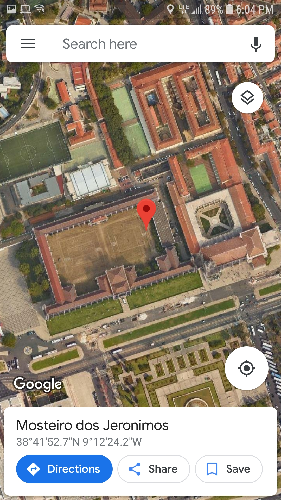
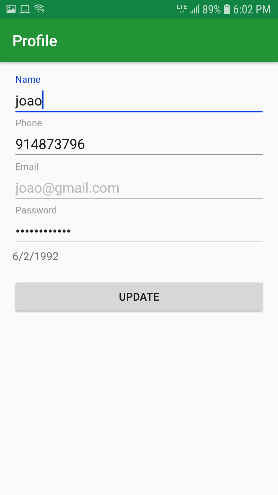
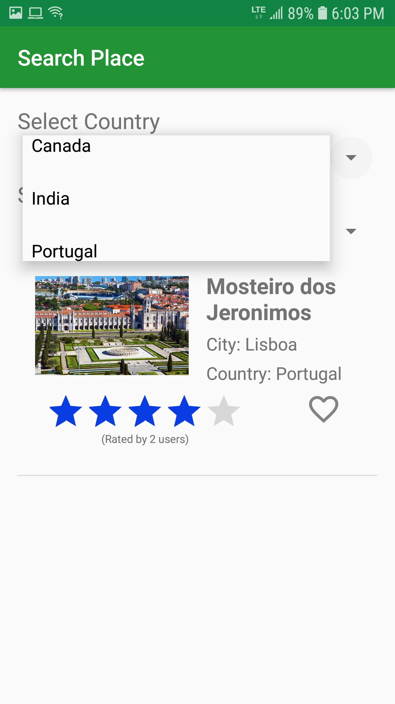
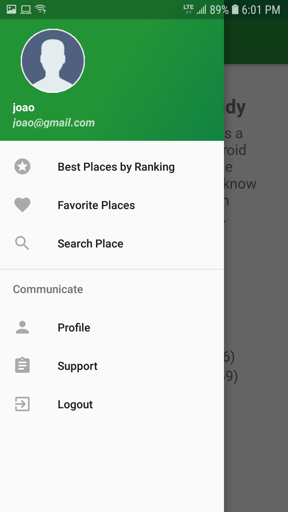
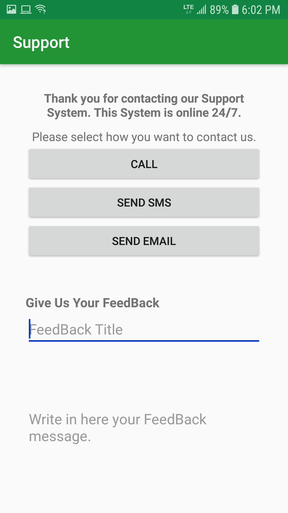
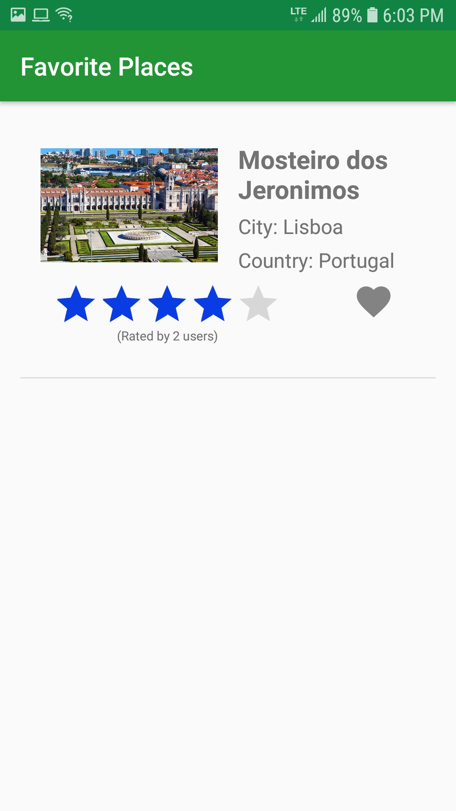
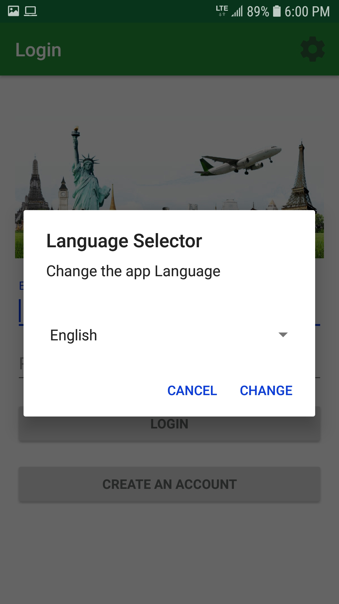
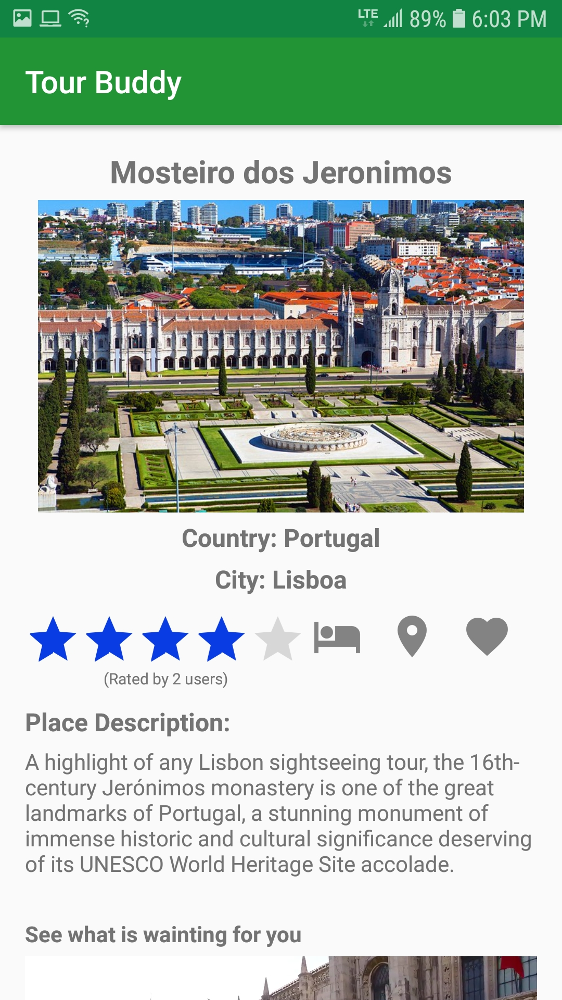
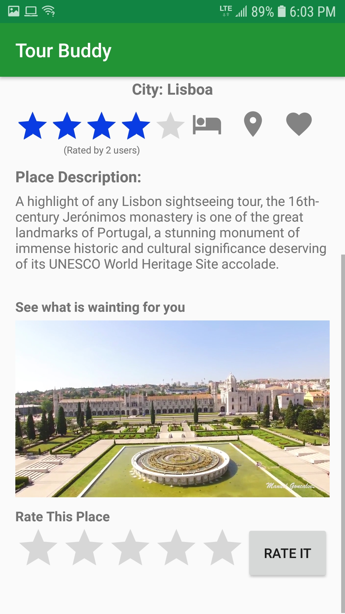

### Tour-Buddy

An application for travel enthusiast to learn new places.

**Technologies** Android,Java fragments, Recycler view.

## Screenshots

# Login Page

# Maps

# Profile Section

# Search

# Side menu

# Support Page

# Favourite Places

# Language Page

# Item selection - 1

# Item selection - 2

