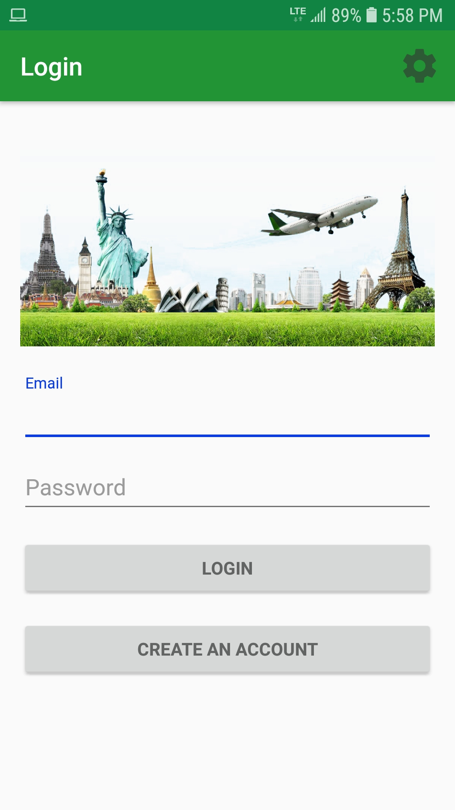
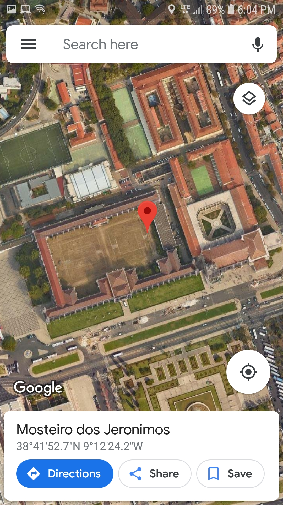
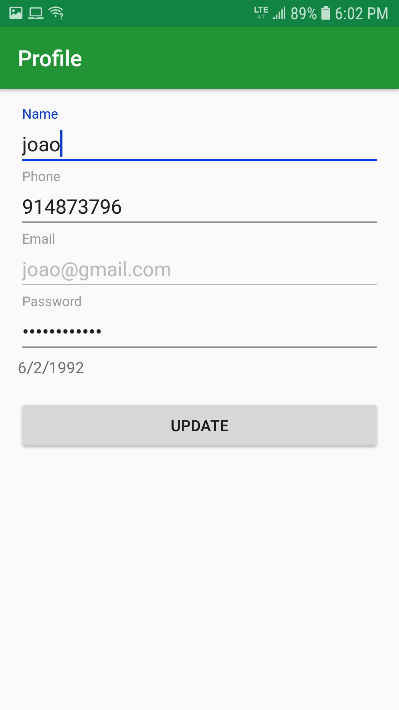
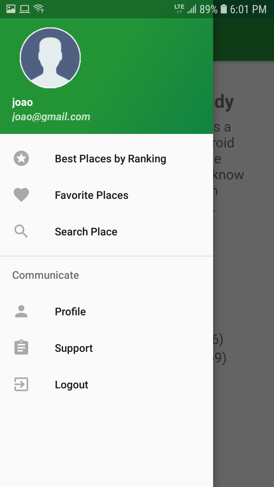
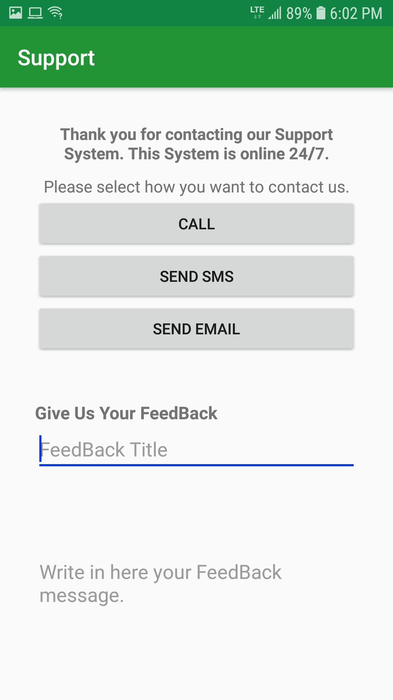
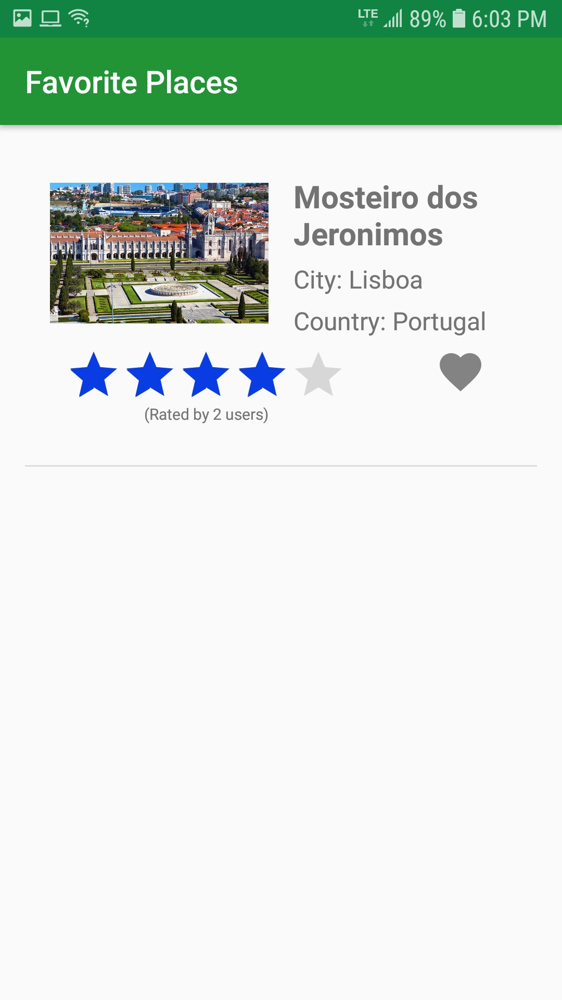
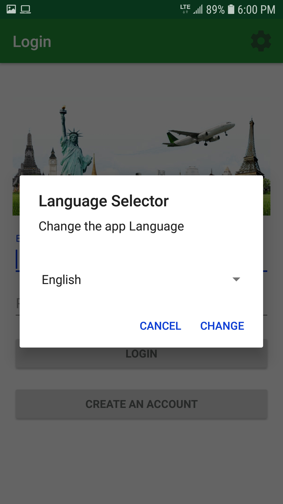
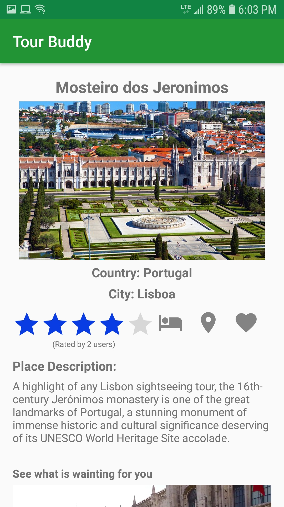
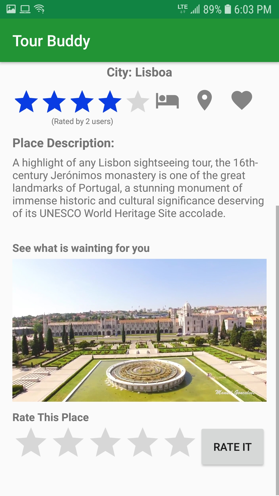

# Tour-Buddy

An application for travel enthusiast to learn new places.

**Technologies used** Android,Java fragments, Recycler view.

# Screenshots

## Login Page

## Maps

## Profile Section

## Search

## Side menu

## Support Page

## Favourite Places

## Language Page

## Item selection - 1

## Item selection - 2

